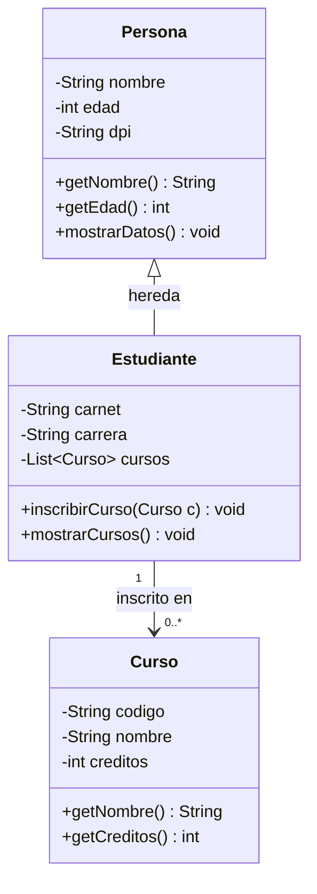

# Ejercicio 13: Diagrama de Clases — Sistema de Estudiantes

## Clases: `Persona`, `Estudiante`, `Curso`

```
┌───────────────────────────┐
│         Persona            │
├───────────────────────────┤
│ - nombre: String           │
│ - edad: int                │
│ - dpi: String               │
├───────────────────────────┤
│ + getNombre(): String       │
│ + getEdad(): int            │
│ + mostrarDatos(): void      │
└──────────────△──────────────┘
               │ herencia (extends)
┌──────────────┴──────────────┐
│         Estudiante           │
├───────────────────────────┤
│ - carnet: String            │
│ - carrera: String           │
│ - cursos: List<Curso>       │
├───────────────────────────┤
│ + inscribirCurso(c: Curso)  │
│ + mostrarCursos(): void     │
└──────────────△──────────────┘
               │
               │ asociación (1 estudiante — muchos cursos)
               │
┌──────────────┴──────────────┐
│            Curso             │
├───────────────────────────┤
│ - codigo: String            │
│ - nombre: String            │
│ - creditos: int             │
├───────────────────────────┤
│ + getNombre(): String       │
│ + getCreditos(): int        │
└───────────────────────────┘
```

## Relaciones aplicadas

- **Herencia**: `Estudiante` **extiende** de `Persona` (un Estudiante ES UNA Persona, con atributos adicionales como `carnet` y `carrera`).
- **Asociación (1 a muchos)**: `Estudiante` **tiene** una lista de `Curso` (un estudiante puede estar inscrito en varios cursos). Se representa con una línea simple y una multiplicidad `1` en el lado de `Estudiante` y `0..*` en el lado de `Curso`.

## Notación UML usada

| Símbolo | Significado |
|---|---|
| `-` | atributo/método `private` |
| `+` | atributo/método `public` |
| `△` (flecha vacía) | herencia (extends) |
| línea simple | asociación |

## Versión en Mermaid (para pegar en herramientas como draw.io, Mermaid Live, o GitHub)


