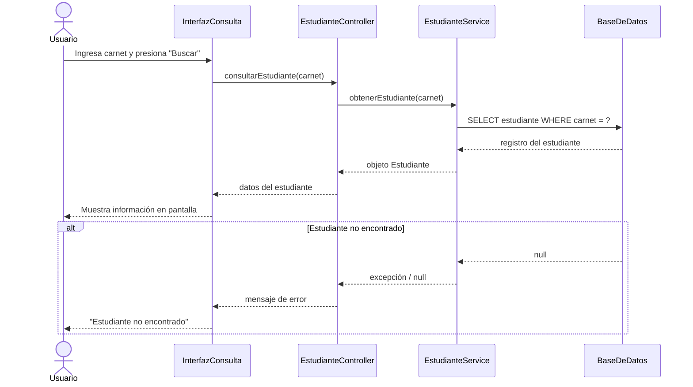

# Ejercicio 14: Diagrama de Secuencia
## Interacción: Usuario consulta información de un estudiante

## Actores/Objetos participantes

- **Usuario** (actor externo)
- **InterfazConsulta** (pantalla / formulario)
- **EstudianteController** (controlador que recibe la solicitud)
- **EstudianteService** (lógica de negocio)
- **BaseDeDatos** (almacenamiento)

## Flujo paso a paso

1. El **Usuario** ingresa el carnet del estudiante en la **InterfazConsulta** y presiona "Buscar".
2. **InterfazConsulta** envía la solicitud a **EstudianteController**, pasando el carnet.
3. **EstudianteController** llama a **EstudianteService** para obtener los datos.
4. **EstudianteService** solicita el registro a **BaseDeDatos**.
5. **BaseDeDatos** devuelve el registro del estudiante (o `null` si no existe).
6. **EstudianteService** procesa la respuesta y la retorna al **EstudianteController**.
7. **EstudianteController** retorna los datos a **InterfazConsulta**.
8. **InterfazConsulta** muestra la información en pantalla al **Usuario**.

Si el estudiante no existe (paso 5 retorna vacío), el flujo cambia:
5a. **BaseDeDatos** no encuentra el registro.
6a. **EstudianteService** retorna un valor nulo/error.
7a. **EstudianteController** envía un mensaje de error.
8a. **InterfazConsulta** muestra "Estudiante no encontrado".

## Versión en Mermaid (diagrama de secuencia)

